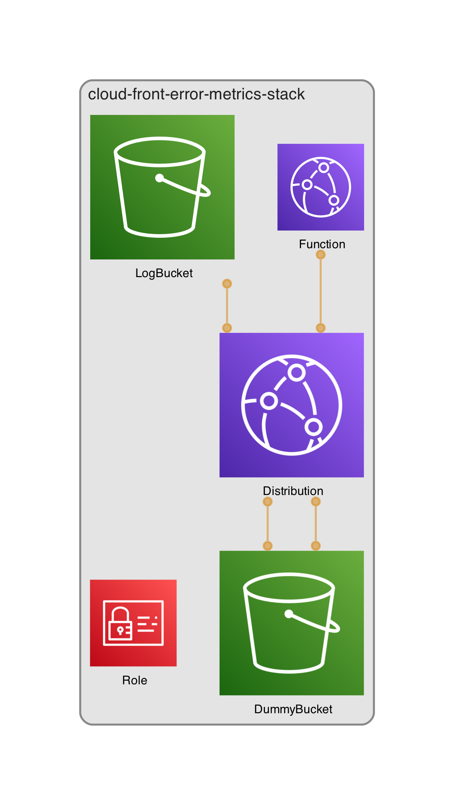

CloudWatch Logs のログを S3 に保存するサンプルです。

目的としては Datadog でアクセスログを取得して、そこからエラーリクエスト数の数が数えたくて、そのために作ったなんちゃってインフラです。

# 構成



構成の出力には https://github.com/pistazie/cdk-dia を使わせて頂いてます！感謝！

# 準備

```
npm install
pip install -r requirements.txt
```

# デプロイ

```
npx cdk -a "python3 app.py" deploy
```
